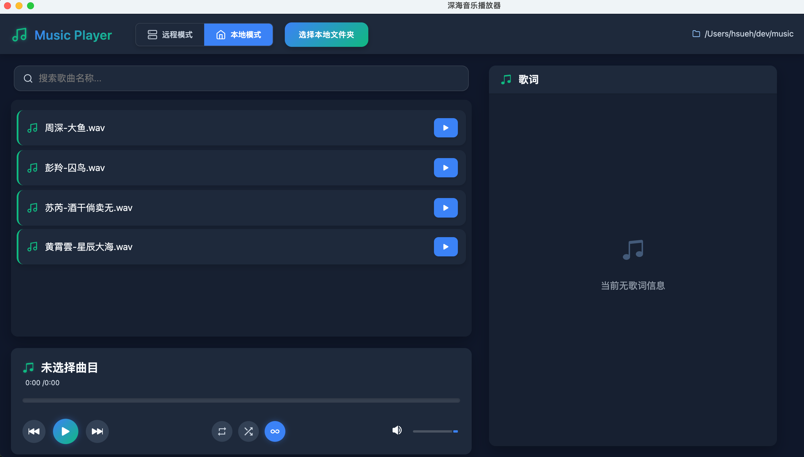

# NAS音乐播放器

🌊 深海音乐播放器 - 专为NAS设计的跨平台音乐播放解决方案

## 项目概述
基于Electron和React构建的专业级音乐播放器，支持本地和远程NAS音乐库管理。支持SFTP协议访问远程服务器，提供流畅的流式播放体验和歌词同步功能。

## 核心功能

✅ **混合存储支持**  
- 本地音乐库管理  
- SFTP远程NAS访问（基于ssh2-sftp-client）  
- 智能缓存机制

🎵 **播放功能**  
- 无损音频流式传输  
- 实时歌词同步（LRC格式）  
- 可视化播放控制界面

🚀 **技术特性**  
- Electron跨平台架构（Windows/macOS/Linux）  
- React 18 + Vite构建  
- 支持Electron Store本地配置存储

## 技术栈

**核心框架**  
- Electron 24.8  
- React 18  
- Vite 4.4

**关键依赖**  
- `ssh2-sftp-client@9.0.4` SFTP连接  
- `electron-store@8.1` 配置持久化  
- `react-icons@5.5` 界面组件

## 快速开始

```bash
# 开发模式
npm run dev

# 构建安装包
npm run package:win
```

## 界面预览



## 许可证
MIT License

Copyright (c) 2023 Hsueh Studio

本软件遵循[MIT许可证](LICENSE)条款，详情请参阅项目根目录的LICENSE文件。
